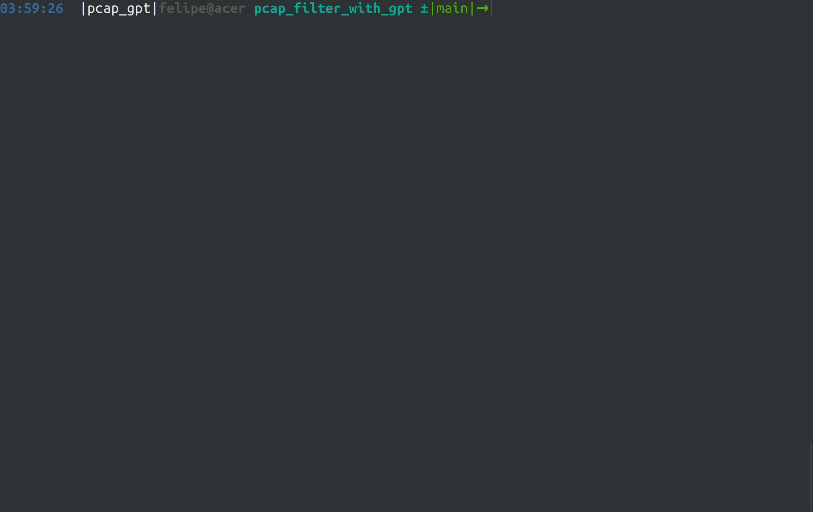

# Pcap filter with GPT

## See how it works!


## Installation
You need to have Conda and a MySQL server installed in your machine. Steps for installing and configuring MySQL server on Ubuntu 20.04 are available in `install.sh`. However, if you have a different Operating System, you will need to install them before running the script. 

`install.sh` contains code for creating the conda environment and installed the required python packages. After executing the script and creating the required environment, you will need to set up some local variables explained next:

### Setting up your OPEN_API_KEY
You will need to create a `.env` file at the root of the project. After that, write the following line in it:

```env
OPENAI_API_KEY="YOUR KEY"
```
The `.env` file will not be pushed to Github, therefore your API key will not be shown in the repository.

### Setting up your MySQL username and password
Inside the same `.env` file created before, add the following:
```env
MYSQL_USER="XXX"
MYSQL_PASSWORD="XXX"
```
The `.env` file will not be pushed to Github, therefore your user and password will not be shown in the repository.